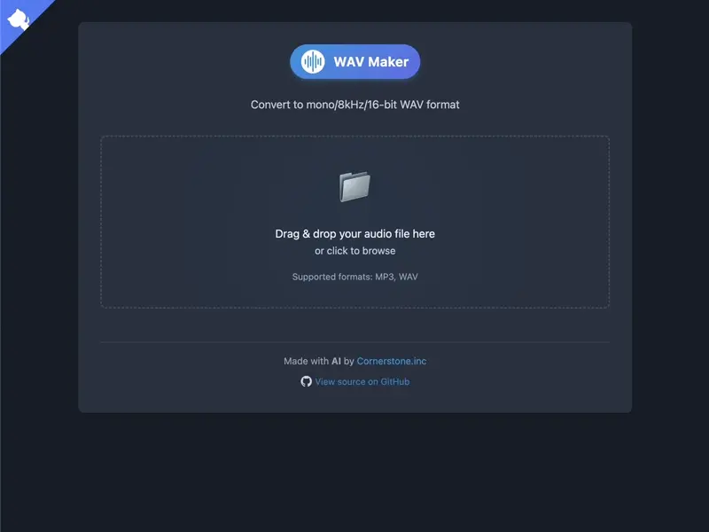
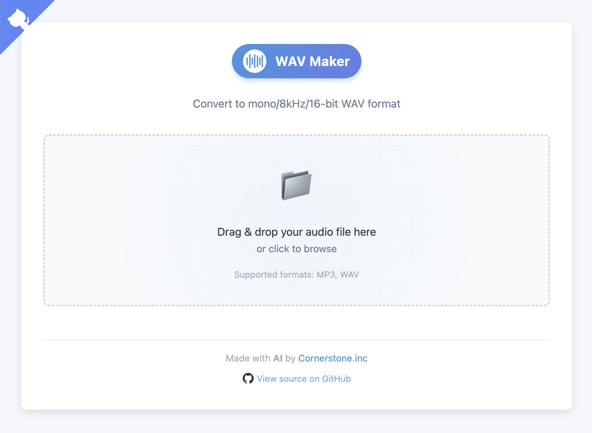
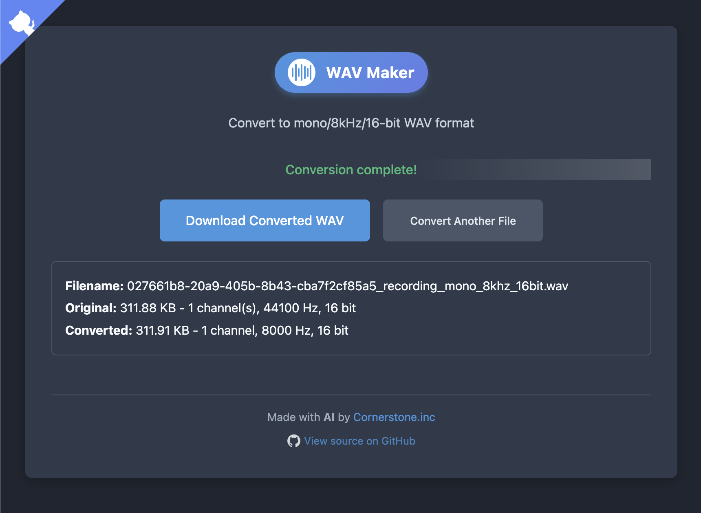

[](https://github.com/RAHB-REALTORS-Association/wav-maker/actions/workflows/build-and-publish.yml)
[](https://opensource.org/licenses/MIT)

<div align="center">
    
</div>
<div align="center">
    <h1>🔉 WAV Maker</h1>
    <p>A lightweight web tool for converting audio files to <strong>mono, 8kHz, 16-bit WAV format</strong>. 🔄🎵</p>
</div>



## 🚀 Overview

This application provides a simple web interface for converting various audio formats (primarily MP3 and WAV) to a standardized mono, 8kHz, 16-bit WAV format. It's designed to be:

* ✅ **Simple**: Easy drag-and-drop interface 🖱️📂
* ⚡ **Fast**: Asynchronous conversion with progress tracking ⏱️
* 🔐 **Secure**: No permanent file storage, automatic cleanup 🧹
* 🧱 **Scalable**: Containerized for easy deployment 🐳
* 💪 **Reliable**: Persistent task tracking for robustness 🏆

## ✨ Features

* 📂 Drag-and-drop file uploads
* 📊 Real-time conversion progress indicators
* 🎶 Support for MP3 and WAV input formats
* 🔒 Secure file handling with automatic cleanup
* 📱 Responsive design that works on mobile and desktop
* 🐳 Docker containerization for simple deployment
* 🗑️ No permanent file storage (files automatically deleted after download)
* 🔁 "Convert Another" functionality for batch processing
* 🌙 Dark Mode / Light Mode

## 📸 Screenshots






## 🛠 Requirements

* 🐳 Docker and Docker Compose

That's it! Everything else runs inside the container. 🚀

## ⚡ Quick Start

### Using GitHub Container Registry (Recommended)

```bash
# Pull the latest image
docker pull ghcr.io/yourusername/wav-maker:latest

# Create a directory for persistent data
mkdir -p task_data

# Run the container
docker run -d -p 5000:5000 -v $(pwd)/task_data:/app/conversion_tasks.json --name wav-maker ghcr.io/yourusername/wav-maker:latest
```

### Building Locally

1. 📥 Clone this repository:

   ```bash
   git clone https://github.com/yourusername/wav-maker.git
   cd wav-maker
   ```

2. ▶️ Start the application with Docker Compose:

   ```bash
   docker-compose up -d
   ```

3. 🌐 Open your browser and go to:

   ```
   http://localhost:5000
   ```

4. 🎧 Drag and drop an audio file, and the converter will do the rest!

## 📁 Project Structure

```
wav_maker/
├── app.py                 # 🧠 Main Flask application
├── requirements.txt       # 📦 Python dependencies
├── Dockerfile             # 🐳 Docker image configuration
├── docker-compose.yml     # 🧩 Docker Compose config
├── static/                # 🎨 CSS and JavaScript
│   ├── style.css
│   └── script.js
├── templates/             # 🖼️ HTML templates
│   └── index.html
└── tests/                 # 🧪 Unit tests
    └── test_app.py
```

## ⚙️ Configuration

Customize through environment variables in `docker-compose.yml`:

| Variable                 | Description                      | Default           |
| ------------------------ | -------------------------------- | ----------------- |
| `MAX_CONTENT_LENGTH`     | 📏 Max upload file size (bytes)  | 104857600 (100MB) |
| `FILE_RETENTION_MINUTES` | 🕒 File retention before cleanup | 30                |

## 🔍 Technical Details

### 🎵 Audio Conversion

Powered by **`pydub`** + **FFmpeg**:

1. Convert to mono 🗣️
2. Resample to 8kHz 🎛️
3. Encode to 16-bit PCM 🧱
4. Export as WAV 📤

### 🔐 Task Management

* 📝 Each conversion has a unique task ID
* 💾 Task status is persistently stored
* 🔄 Status is tracked through the entire process
* 🧹 Auto-cleanup of old tasks and files

### 🛡️ Security Considerations

* 🧍 Runs as non-root in Docker
* ⚠️ File size limits prevent DoS
* 🧼 Temp storage prevents bloat
* 🧯 Sanitized filenames = no path traversal

## 👨‍💻 Development

To modify and test:

1. Edit source files ✏️
2. Rebuild & restart Docker:

   ```bash
   docker-compose up --build -d
   ```

### 🧪 Running Tests

Run the test suite with:

```bash
# Install test dependencies
pip install pytest pytest-cov

# Run tests
pytest tests/ --cov=app
```

### 🧪 Local Dev Without Docker

1. Install dependencies:

   ```bash
   pip install -r requirements.txt
   ```

2. Install FFmpeg:

   * 🐧 Ubuntu/Debian: `sudo apt-get install ffmpeg`
   * 🍎 macOS: `brew install ffmpeg`
   * 🪟 Windows: [Download](https://ffmpeg.org/download.html)

3. Run app:

   ```bash
   python app.py
   ```

## 🚀 CI/CD

This project uses GitHub Actions for continuous integration and delivery:

* 🧪 Automatic testing on push and pull requests
* 🐳 Docker image building and publishing to GitHub Container Registry
* 📦 Automatic release creation on version tags

## 🩺 Troubleshooting

### 🔧 Common Issues

1. **❌ "File not found or conversion not complete"**

   * File was likely already deleted. Try again.

2. **❌ "Error during conversion"**

   * Check file format and FFmpeg install.

3. **❌ Container won't start**

   * Check for port conflicts:
     `sudo lsof -i :5000`
   * View logs:
     `docker-compose logs`

### 📜 Logs

Follow logs in real-time:

```bash
docker-compose logs -f
```

## 🙌 Acknowledgments

* 🛠 [Pydub](https://github.com/jiaaro/pydub)
* 🌐 [Flask](https://flask.palletsprojects.com/)
* 🎛 [FFmpeg](https://ffmpeg.org/)

## 📄 License

MIT License – see the [LICENSE](LICENSE) file 📘
